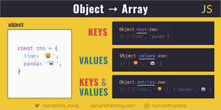

# Объект

## Tип Objectпредставляет один из типов данных JavaScript . Он используется для хранения различных коллекций с ключами и более сложных объектов. Объекты могут быть созданы с использованием Object()конструктора или синтаксиса инициализатора объекта/литерала .

### обект берет значение через имя а массив чарез значения

### Почти все объекты в JavaScript являются экземплярами Object; типичный объект наследует свойства (включая методы) от Object.prototype, хотя эти свойства могут быть затенены (то есть переопределены). Единственные объекты, которые не наследуются от, Object.prototype— это объекты с nullпрототипом или потомки других nullобъектов-прототипов.

### Изменения объекта Object.prototypeвидны всем объектам посредством цепочки прототипов, если только свойства и методы, подверженные этим изменениям, не переопределяются далее по цепочке прототипов. Это обеспечивает очень мощный, хотя и потенциально опасный механизм переопределения или расширения поведения объекта. Чтобы сделать его более безопасным, Object.prototypeэто единственный объект в ядре языка JavaScript, который имеет неизменяемый прототип — прототип Object.prototypeвсегда nullи неизменяем.

### Вам следует избегать вызова любого Object.prototypeметода непосредственно из экземпляра, особенно тех, которые не предназначены для полиморфизма (т. е. имеет смысл только их начальное поведение, и ни один убывающий объект не может переопределить его значимым образом). Все объекты, наследуемые от, Object.prototypeмогут определять собственное собственное свойство с тем же именем, но с семантикой, совершенно отличной от ожидаемой. Более того, эти свойства не наследуются nullобъектами -prototype . Все современные утилиты JavaScript для работы с объектами являются статическими . Более конкретно:

### В случае, если семантически эквивалентный статический метод не существует или если вы действительно хотите использовать этот Object.prototypeметод, вместо этого вам следует напрямую использовать call()метод Object.prototypeдля целевого объекта, чтобы предотвратить наличие у объекта переопределяющего свойства, которое приводит к неожиданным результатам.

<b style="margin-left:100px;"></b>

# This 

### Ключевое слово this функции ведет себя в JavaScript немного иначе, чем в других языках. Он также имеет некоторые различия между строгим и нестрогом режимом.

### В большинстве случаев значение this определяется тем, как вызывается функция (привязка времени выполнения). Его нельзя установить путем присваивания во время выполнения, и он может меняться каждый раз при вызове функции. Метод Function.prototype.bind() может устанавливать значение this для функции независимо от того, как она вызывается, а стрелочные функции не предоставляют собственную привязку this (они сохраняют значение this включающего лексического контекста).

### Значение this зависит от того, в каком контексте оно появляется: в функции, классе или глобальном.

### Контекст функции
### Внутри функции значение this зависит от того, как функция вызывается. Думайте об этом как о скрытом параметре функции — как и параметры, объявленные в определении функции, это привязка, которую язык создает для вас при вычислении тела функции.

### Для типичной функции значением this является объект, к которому осуществляется доступ к функции. Другими словами, если вызов функции имеет форму obj.f(), то это относится к obj. Например: